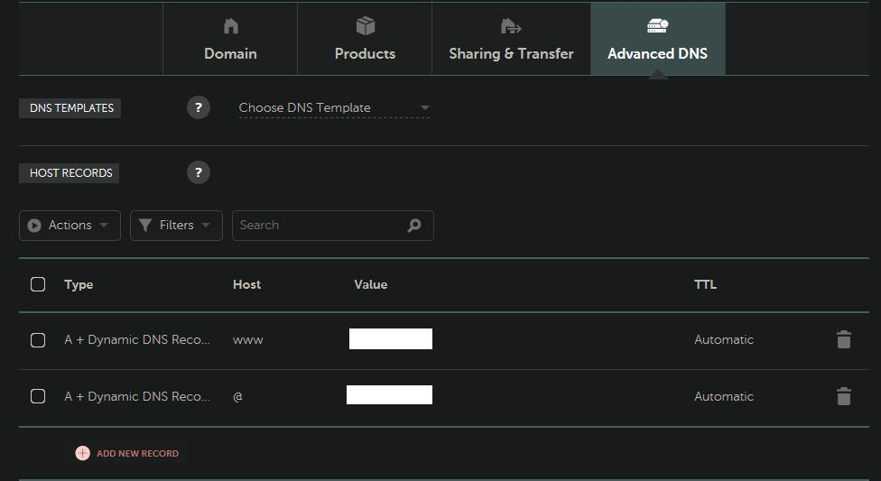

While I already had a decent understanding of how the internet works, I rarely had practical ways to apply that knowledge. Sure, I knew the terms "DNS", "Name Servers", "Firewalls", etc, and generally knew how they all worked together, but I had never end-to-end configured a bare metal server to host a website. In retrospect, configuring a server from scratch proved to be a great learning experience.

## Context:

I had an old \$50 HP 8300 SFF desktop computer, an old but plenty-capable machine with it's i5 intel processor and 8GB of RAM. I was already using it to host a Plex Media server, Calibre-Web server, and a few other web services on this machine. It had been chugging along for many months now, and has been great to work with.

However, my past self had unfortunately set it up with desktop Ubuntu without SSH, which led to requiring the GUI for to administer this machine. Not being able to do remote administration was a constant friction point, especially since the device was in the far corner of my living room.

## Goals:

So the goals I laid out were the following:

1. Install Ubuntu Server LTS (at the time of this post, 20.04 LTS is the latest version)
2. Setup SSH for remote administration
3. Setup Nginx, a firewall, and port forwarding for to enable hosting a site
4. Enable Dynamic DNS so that I could map a domain name to my server
5. Setup HTTPS with a Let's Encrypt certificate + autorenewal
6. Host some static HTML via nginx and have a fully functional site up and running

## Equipment:

- Computer to use as a Server (an old desktop, laptop, etc)
- Internet Router where you can setup Port Forwarding
- Domain name via a registrar (I used Namecheap)
- USB/DVD/etc - for to setup OS install media. Use whatever is appropriate for your machine
- (optional, but recommended) Personal use computer for remote administration of the server (this personal computer must be able to SSH into remote machines)

## Steps

Part 1: Setup your server

1. Download and setup a Ubuntu Server USB installer
2. Boot your server, and boot the installer via USB
3. Install Ubuntu server, setup your login info, etc
4. Once setup, you should be able to login to the device on boot

Part 2: Setup SSH keys / Disable SSH Password login

1. Create an SSH Key on the machine you'll be using for remote administration
2. Copy the public key file of your generated SSH key (by default, it's at `~/.ssh/id_rsa.pub` on your machine). You will need to transfer a copy of this file to your server, how you choose to do so is up to you.
3. Take the contents of the public key file, and appended it to the end of the `/home/username_here/.ssh/authorized_keys` file on the Server
4. To test and make sure this worked, attempt to SSH into your server. To do so, first, figure out the server's address on your local LAN (it should look something like `192.168.XX.XX`)
5. after figuring out your server's address on your local LAN, on your remote administration machine attempt the following:

```
ssh username_goes_here@server_LAN_address_here
e.g.
ssh aarron@192.168.XX.XX
```

Since you setup SSH keys, it should auto-log you in.

6. Once your SSH keys are setup, time to disable SSH password login. Edit your `/etc/ssh/sshd_config` file on your server, and find + change to the following:

```
ChallengeResponseAuthentication no
PasswordAuthentication no
UsePAM no
PermitRootLogin no
```

After saving your changes, run `sudo service sshd restart` and `sudo service ssh restart`

7. To verify the changes, attempt `ssh root@LAN_address_here`. It should fail

Part 3: Setup NGINX, firewall, and port forwarding

1. Install nginx with `sudo apt install nginx`
2. Start nginx with `sudo service nginx start`
3. To make sure it's working, go to `http://192.168.XX.XX:80` in your browser, it should display the nginx default page. If you'd like to change the static HTML pages being served by nginx, you can change your files located at `/var/www/html`. If you want to host a web app, you'll need to edit your `nginx.conf` file accordingly
4. Once we confirmed that it's working, we now need to setup a firewall (we'll use a simple firewall, `ufw`. feel free to use whatever you're comfortable with)
5. run `sudo ufw enable`.
6. enable SSH by running `sudo ufw allow ssh`
7. Check to see if the firewall is still working. If you revisit `http://192.168.XX.XX:80`, your firewall should now be blocking the standard HTTP port
8. to reenable HTTP, run `sudo ufw allow http`
9. Revisit the url and make sure the webpage now renders
10. Now that your server is properly serving HTTP requests on the expected port, we now need to port forward from your network gateway (e.g. your home router, etc) to your server. Look up how to port forward on your router, and forward port 80 to the server
11. To verify that this worked, first figure out your public IP (you can visit https://domains.google.com/checkip) in a browser. Then, in your browser, type in your public IP address, it should display the nginx default page.

Part 4: Setup Domain Name

1. Purchase a domain name of your choice from your preferred provider. I went with namecheap
2. Setup a Dynamic DNS record according to your provider. Depending on your provider, there are different ways to do so. I'll be detailing how to handle namecheap, specifically, in the following instructions
3. Go to the `Advanced DNS` and enable Dynamic DNS. Copy down this password some place secure, you'll need this later.
4. On `Advanced DNS` page, create 2 dynamic DNS entries:

- Host: @, value: 127.0.0.1 (we'll change this later), TTL: Automatic
- Host: www, value: 127.0.0.1 (same, we'll change later), TTL: Automatic


5. We're going to setup dynamic DNS with [ddclient](https://github.com/ddclient/ddclient) in a Docker container. To do so, first install the docker daemon + other utils, including docker-compose (you can look up this part)
6. Once you have docker installed, we're going to use the following `docker-compose.yml` file:

```yml
version: '3.7'

services:
  ddclient:
    image: linuxserver/ddclient
    container_name: ddclient
    environment:
      - PUID=1000
      - PGID=1000
      - TZ=America/New_York
    volumes:
      # NOTE: make sure to replace the filepath with a place
      # where you want to store the ddclient config files
      - /filepath_on_server_machine:/config
    restart: unless-stopped
```
7. once your `docker-compose.yml` file is setup, run `sudo docker-compose up -d`, which should spin up a ddclient container.
8. confirm that there is now a `ddclient.conf` file inside the filepath you specified on the server. Once you confirm that the file is there, run `sudo docker-compose down` to stop the contianer.
9. Find the `namecheap` entry in the `ddclient.conf` file, and edit it to as follows:

```
use=web, web=https://dynamicdns.park-your-domain.com/getip
protocol=namecheap
server=dynamicdns.park-your-domain.com
login=your_url_goes_here
password=advanced_dns_password_here
@, www
```

10. Save you changes, run `sudo docker-compose up -d` again. Run `sudo docker logs ddclient`, you should see a message similar to this:

```
SUCCESS:  updating @: good: IP address set to your_public_ip_address
SUCCESS:  updating www: good: IP address set to your_public_ip_address
```

Your Namecheap DNS entries should have also been updated to the new IP address. You should now be able to visit your url (no HTTPS yet)

Part 5: setup SSL certificate for HTTPS

1. Now that HTTP is working properly, we can now setup HTTPS.
2. This part is fairly straightforward with [certbot](https://certbot.eff.org/), which is what we'll be using here.
3. Before running certbot, edit your `server_name` in the `/etc/nginx/sites-available/default` file, as seen below:

```
 # change server_name to have a list of your urls
 server_name your_root_url_without_www your_url_with_www
 e.g.
 server_name test.com www.test.com
```

Restart your nginx service after saving this change with `sudo service nginx restart`

4. after your server_name is updated, install certbot via the instructions at the official certbot site.
5. after installation, run `sudo certbox --nginx`, and follow the prompts
6. run `sudo ufw allow https`, and setup port forwarding on your router for port 443
7. You should now have a valid SSL cert for your website, go revisit your website (but use `https` instead), and it should just work!
8. (optional) you can enable HTTP2 by editing the following lines in your `nginx.conf` to include `http2`:

```
  listen [::]:443 http2 ssl ipv6only=on; # managed by Certbot
  listen 443 http2 ssl; # managed by Certbot
```
9. if you setup HTTP2, don't forget to restart the nginx service!

And with that, you should be fully hosting a website on your own server in your living room!